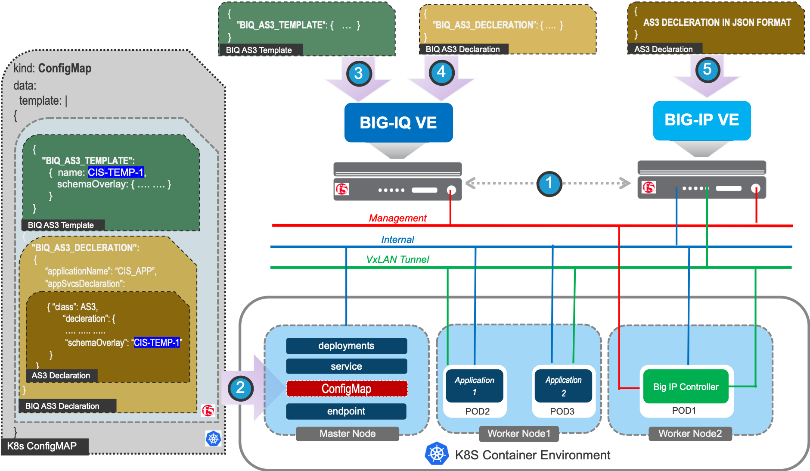

# CIS integration with BIG-IQ

**This GitHub repository has been archived and is read-only. This project is no longer actively maintained**

This github page documents how to use BIG-IQ with CIS and some details on their integration.

**Note** This integration of **BIG-IQ and CIS** is for early field trials/experimental and demo purpose. We would like to get some feedback and potentially make improvements. The integration has not gone through regression testing. 

## Setup view of CIS BIG-IQ Integration
Below is a step by step representation of CIS and BIG-IQ integration setup:

## API call flow between CIS, BIG-IQ and BIG-IP
For understanding what is happening in the CIS and BIG-IQ integration, below call flow provides some details.
This figure also depicts some implementation details.

